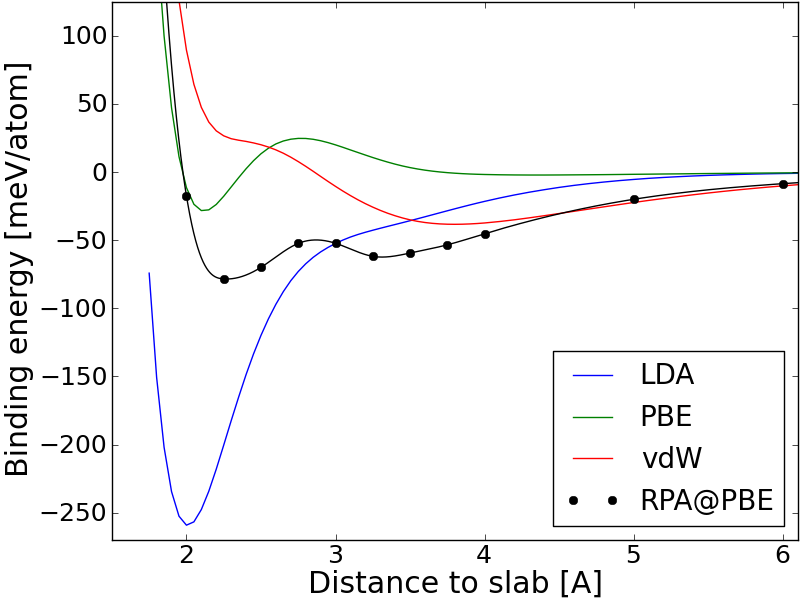

.. _rpa_tut:

==========================================================
Calculating RPA correlation energies
==========================================================

The Random Phase Approximation (RPA) can be used to derive a non-local expression for the ground state correlation energy. The calculation requires a large number of unoccupied bands and is significantly heavier than standard DFT calculation using semi-local exchange-correlation functionals. However, when combined with exact exchange the method has been shown to give a good description of van der Waals interactions as well as covalent bonds.

For more details on the theory and implemenation we refer to :ref:`rpa`. Below we give examples on how to calculate the RPA atomization energy of :math:`N_2` and the correlation energy of a Kr fcc lattice. Note that these tutorials will need a lot of CPU time and is essentially not possible without a supercomputer.

Example 1: Atomization energy of N2
===================================

The atomization energy of :mol:`N2` is overestimated by typical GGA functionals, and the RPA functional seems to do a bit better. This is not a general trend for small molecules, however, typically the HF-RPA approach yields to small atomization energies when evaluated at the GGA equilibrium geometry. See for example Furche \ [#Furche]_ for a table of atomization energies for small molecules calculated with the RPA functional. The main advantage is that RPA includes non-local correlation as well as giving a reasonable description of covalent bonds and the functional has no fitted parameters.

Ground state calculation
--------------------------

First we set up a ground state calculation with lots of unoccupied bands. This is done with the script:

.. literalinclude:: gs_N2.py

which takes on the order of 20 CPU hours. The script generates N.gpw and N2.gpw which are the input to the RPA calculation. The PBE and non-selfconsistent Hartree-Fock energy is also calculated and written to the file PBE_HF.dat.

Converging the frequency integration
-------------------------------------

We will start by making a single RPA calculation with extremely fine frequency sampling. The following script returns the integrand at 2001 frequency points from 0 to 1000 eV at a particular q-point (since there is no k-point sampling, only q=[0,0,0] is possible here and one therefore needs to specify a direction as well):

.. literalinclude:: frequency.py

The correlation energy is obtained as the integral of this function divided by :math:`2\pi` and yields -6.23738879181 eV. The frequency sampling is dense enough so that this value can be regarded as "exact". We can now test the Gauss-Legendre integration method with different number of points using the same script but now specifying the gauss_legendre parameters instead of a frequency list:: 

    Es = rpa.get_E_q(ecut=ecut, 
                     gauss_legendre=16,
                     frequency_cut=800, 
                     frequency_scale=2.0, 
                     integrated=False,
                     q=[0,0,0], 
                     direction=0)

This is the default parameters for Gauss-legendre integration. The gauss_legendre keyword specifies the number of points, the frequency_cut keyword sets the value of the highest frequency (but the integration is always an approximation for the infinite integral) and the frequency_scale keyword determines how dense the frequencies are sampled close to :math:`\omega=0`. The integrals for different number of Gauss-Legendre points is shown below as well as the integrand evaluated at the fine equidistant frequency grid

.. image:: E_w.png
	   :height: 400 px

.. image:: con_freq.png
	   :height: 400 px

It is seen that using the default value of 16 frequency points gives a result which is very well converged (to 0.1 meV). Below we will simply use the default values allthough we could perhaps use 8 points instead of 16, which would half the total CPU time for the calculations. In this particular case the result is not very sensitive to the frequency scale, but if the there is a non-vanishing density of states near the Fermi level, there may be much more structure in the integrand near :math:`\omega=0` and it is important to sample this region well. It should of course be remembered that these values are not converged with respect to the number of unoccupied bands and plane waves, which were calculated with a cutoff at 200 eV.

Extrapolating to infinite number of bands
-----------------------------------------

To calculate the atomization energy we need to obtain the correlation energy as a function of number of bands and extrapolate to infinity as explained in :ref:`rpa`. This is accomplished with the script:

.. literalinclude:: rpa_N2.py

which calculates the correlation part of the atomization energy with the bands and plane waved corresponding to the list of cutoff energies. Note that the default value of frequencies (16 Gauss-Legendre points) is used and the calculation parallelizes efficiently over the frequencies. The result is written to rpa_N2.dat and can be visualized with the script::

    import numpy as np
    from pylab import *

    A = np.loadtxt('rpa_N2.dat').transpose()
    plot(A[0]**(-1.5), A[1], 'o', label='Calculated points')

    xs = np.array([A[0,0]+i*100000. for i in range(50000)])
    plot(xs**(-1.5), -4.969+1993*xs**(-1.5), label='-4.969+1993*E^(-1.5)')

    t = [int(A[0,i]) for i in range(len(A[0]))]
    xticks(A[0]**(-1.5), t, fontsize=12)
    axis([0.,150**(-1.5), None, -4.])
    xlabel('Cutoff energy [eV]', fontsize=18)
    ylabel('RPA correlation energy [eV]', fontsize=18)
    legend(loc='lower right')
    show()

The result is shown below

.. image:: extrapolate.png
	   :height: 400 px

The fit is seen to be very good at the last three points and we find an extrapolated value of -4.96 eV for the correlation part of the atomization energy. The results are summarized below (all values in eV	)

======   =====   =====   ======       ============
PBE      HF      RPA     HF+RPA       Experimental
======   =====   =====   ======       ============
10.60	 4.64    4.96    9.60	  	9.89
======   =====   =====   ======       ============

One should also be aware that due to the non-local nature of the RPA functional, very large supercells are needed to avoid spurious interactions between repeated images and the calculation done for the 6x6x7 cell used here is not expected to be fully converged with respect to super cell size. In fact, the present super cell is not even large enough for the PBE and HF calculations to be converged. See ref. \ [#Harl]_ for more details on this. It should be noted that in general, the accuaracy of RPA is comparable to that of PBE calculations and N2 is just a special case where RPA performs better than PBE. The major advantage of RPA is the non-locality, which results in a good description of van der Waals forces. The true power of RPA thus only comes into play for systems where dispersive interaction dominate.

Example 2: Adsorption of graphene on metal surfaces
===================================================

As an example where dispersive interactions are known to play a prominent role, we consider the case af graphene adsorpbed on a Co(0001) surface [#Olsen]_. First, the input .gpw files are generated with the following script: 

.. literalinclude:: gs_graph_Co.py

Note that besides diagonalizing the full Hamiltonian for each distance, the script calculates the EXX energy at the self-consistent PBE orbitals and writes the result to a file. It should also be noted that the kpoint grid is centered at the Gamma point, which makes the *q*-point reduction in the RPA calculation much more efficient. In general, RPA and EXX is more sensitive to Fermi smearing than semi-local functionals and we have set the smearing to 0.01 eV. Due to the long range nature of the van der Waals interactions, a lot of vacuum have been included above the slab. The calculation should be parallelized over spin and irreducible *k*-points. 

The RPA calculations are done with the following script

.. literalinclude:: rpa_graph_Co.py

Here we have changed the frequency scale from the deafualt value of 2.0 to 2.5 to increase the density of frequency points near the origin. We also specify that the calculation should be parallelized over 128 *k*-points but any number divisibe by the toal number of Brillouin zone *k*-points (256) would be ok. The default paralellization scheme is over frequency points but *k*-point parallelization is much more efficient for solid state systems. Finally, we specify that the Gamma point (in *q*) should not be included since the optical limit becomes unstable for systems with high degeneracy near the Fermi level. The restart file contains the contributions from different *q*-points, which is read if a calculation needs to be restarted.

In principle, the calculations should be performed for a range of cutoff energies and extrapolated to infinity as in the example above. However, energy differences between systems with similar electronic structure converges much faster than absolute correlation energies and a reasonably converged potential energy surface can be obtained using a fixed cutoff of 200 eV for this system.

The result is shown in the Figure below along with LDA, PBE and vdW-DF results. The solid RPA line was obtained using spline interpolation.

Both LDA and PBE predicts adsorption at 2.0 A from the metal slab, but do not include van der Waals attraction. The van der Waals functional shows a significant amount of dispersive interactions far from the slab and predicts a physisorbed minimum 3.75 A from the slab. RPA captures both covalent and dispersive interactions and the resulting potential energy surface is a delicate balance between the two types of interactions. Two minima are seen and the covalent bound state at 2.2 A is slightly lower that the physorbed state at 3.2 A, which is in good agreement with experiment.

.. [#Furche] F. Furche,
             *Phys. Rev. B* **64**, 195120 (2001)

.. [#Harl] J. Harl and G. Kresse,
           *Phys. Rev. B* **77**, 045136 (2008)

.. [#Olsen] T. Olsen, J. Yan, J. J. Mortensen and K. S. Thygesen
           *Phys. Rev. Lett* **107**, 156401 (2011)
